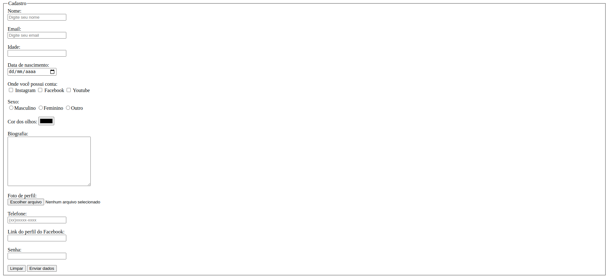

# Tela de Cadastro

> Exercício proposto para colocar em prática os conhecimentos adquiridos em     HTML durante as aulas do Code Club.

### Desafios:

- [x] Você deve reproduzir o mais parecido possível a tela mostrada na Aula.
- [x] Não vale usar CSS nem JavaScript.

- [x] Todos os inputs devem conter o parâmetro "name" devidamente preenchido e condizente com o campo.
- [x] No campo email, devem ser permitidos apenas emails válidos.

- [x] Os inputs do tipo radio só devem permitir a escolha de um sexo.
- [x] O input de idade não deve permitir submeter idades abaixo de 12 anos.
- [x] No campo de upload de foto são apenas permitidos arquivos do tipo foto.
- [x] No campo perfil do facebook devem ser permitidos apenas URL's válidas.

- [x] No campo de senha devem ser permitidos senhas entre 6 e 8 caracteres.
- [x] O botão limpar deve deixar todos os campos em branco.
- [x]  O botão Enviar deve submeter os dados.

